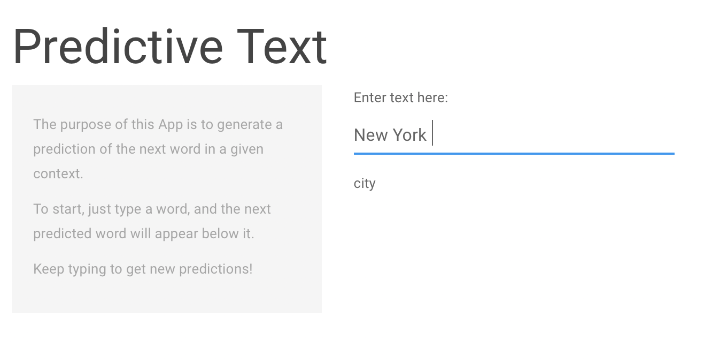

Text Prediction with Swiftkey
========================================================
author: Mackenzie Young
date: 7/31/2018
autosize: true
css: mySlideTemplate.css

Text Prediction App
========================================================
This Text Prediction App uses the relationship between words to produce a prediction of the next word in a given context.

For example, it is very likely that the phrase 'New York' will be followed by the word 'city'.

So, we want the App to produce 'city' when given 'New York'.

The data used in this model can be downloaded [here](https://d396qusza40orc.cloudfront.net/dsscapstone/dataset/Coursera-SwiftKey.zip).

To use the App yourself, click [here](https://mackenzieyoung.shinyapps.io/text-predict/).

Prediction model
========================================================
The prediction model uses information about n-gram frequencies to make its predictions. N-grams are groups of words that frequently occur together.

'New York' is an example of a frequently-occuring bigram, and 'New York city' is a trigram.

This model uses trigram, bigram, and unigram frequencies, which are stored in frequency tables. 

Unfortunately, while using quadgrams would result in better predictions, the App runs too slowly when they are included.

Back-off
========================================================
This model also needs to account for sequences that it has never seen before.

If the final two words in a sequence do not appear together in the trigram look-up table, the model 'backs-off' to the bigram look-up table.

For example, if the trigram table does not include the words 'aquatic garden' together as word1 and word2, it will produce the word that most frequently follows the word 'garden' from the bigram look-up table.

If a word does not appear in the bigram table, the model 'backs-off' to the unigram table, and produces the most frequent word. In this case, the most frequent unigram is 'the'.

The Shiny App
========================================================
The Shiny App predicts 'city' when given 'New York', as expected.

